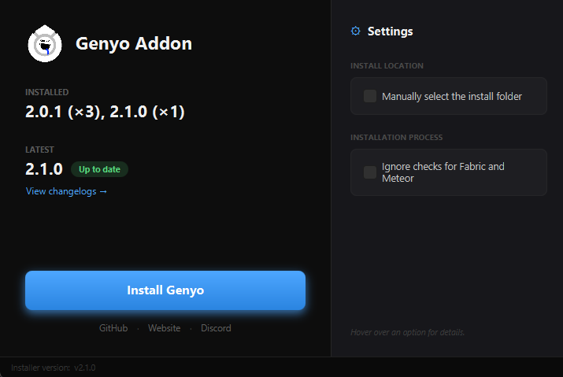

# Welcome to Genyo Installer

The Java *(JavaFX)* port of the [original Genyo Installer](https://github.com/wuritz/GenyoInstaller-old) that I wrote in C# using Visual Studio.

## Features
- Automatically detects your Prism Launcher instances, and gives you the option to choose which ones you would like to install Genyo to.
- Searches for Fabric and Meteor, and blocks if it can't find them.
- Ability to choose between only MC default or Prism launcher
- Ability to install into a manually given folder
- Keeping track of installed versions... uhhh kinda.

## Preview

Just to clarify, as seen on the picture above, the installer and the addon's latest versions matching are pure coincidence :D
